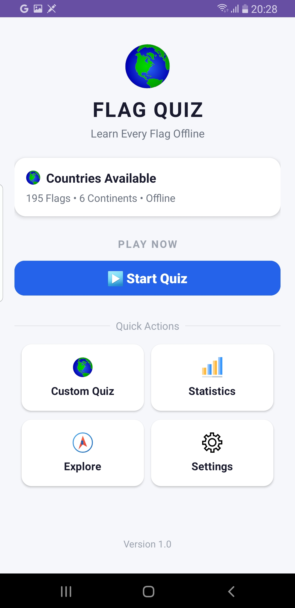
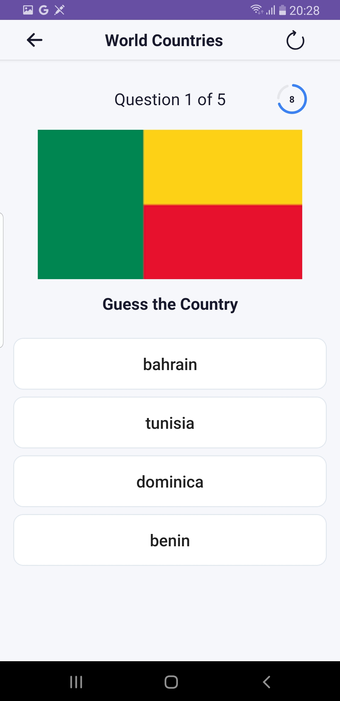
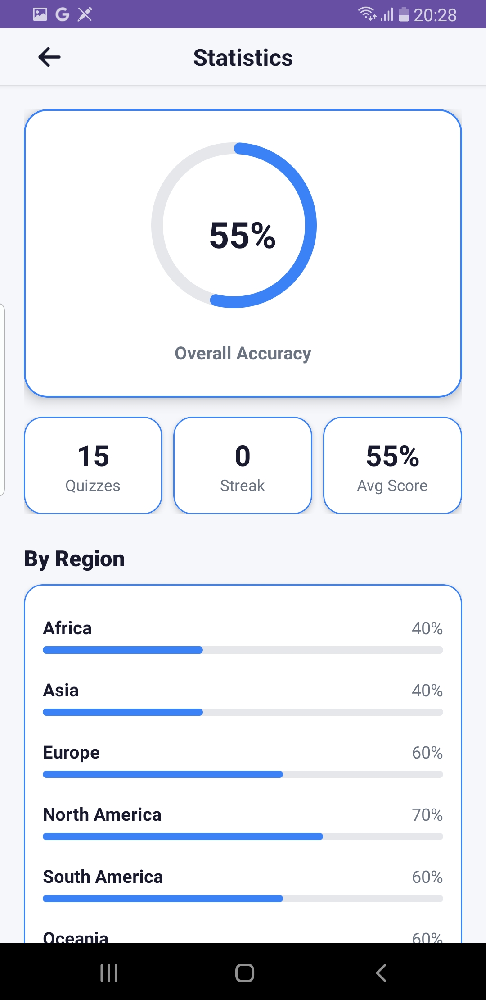
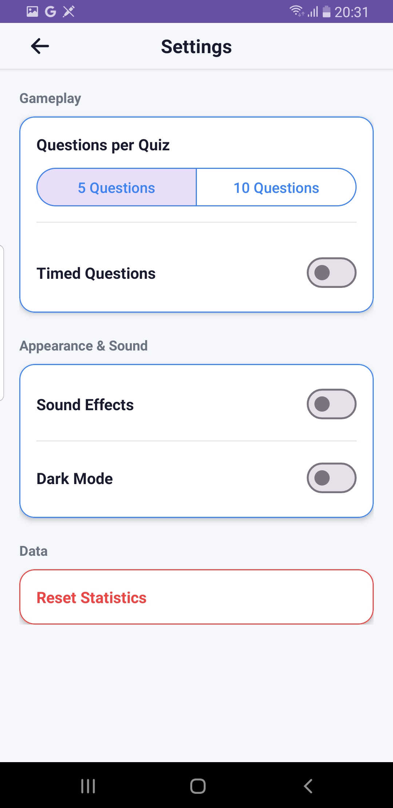
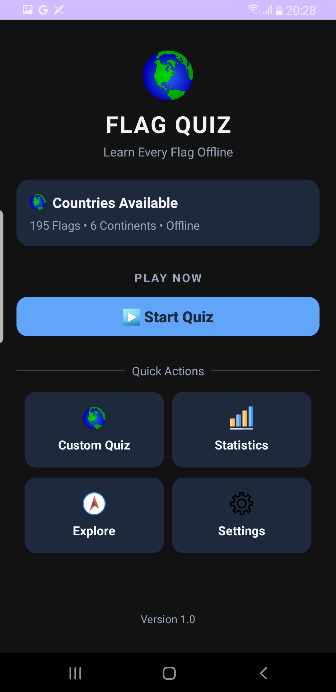

#  Flag Quiz Game

A native Android app for learning country flags through interactive, continent based quizzes  with timed rounds, a persistent stats dashboard, and full dark mode support. Built entirely offline.


## Overview

Flag Quiz Game is a fully offline Android app that helps you learn and test your knowledge of country flags. Pick a continent, race the clock, and track your progress over time all without an internet connection.

Every screen was built with intention: real geographic data, a persistent statistics engine backed by Room, and a light/dark theme that's actually implemented end-to-end rather than bolted on.

##  Features

- **Continent-based quizzes** — filter flags by Africa, Asia, Europe, North America, South America, or Oceania
- **Explore mode** — browse every flag in a region at your own pace, outside of quiz pressure
- **Custom quiz length** — choose 5 or 10 questions per round
- **Timed rounds** — optional countdown with a live circular progress ring; a color shift (blue → amber → red) signals urgency as time runs low
- **Persistent statistics** — a Room-backed dashboard tracking overall accuracy, current streak, average score, per-continent breakdown, and recent quiz history
- **Full dark mode** — a real light/dark color system across every screen, not just an inverted background
- **Sound feedback** — correct/incorrect answer sounds, toggleable in Settings
- **100% offline** — every flag and every byte of data lives on-device; no network calls, no ads, no tracking

##  Screenshots



.

.

.

.


##  Built With

- **Java** — primary language
- **Material 3 (Material Components for Android)** — UI components, theming
- **Room** — local persistence for quiz history and statistics
- **SharedPreferences** — lightweight settings storage
- **ConstraintLayout / GridLayout** — responsive, adaptive screen layouts
- **AssetManager** — offline flag image + data loading

##  Architecture

The app is structured around a small number of focused Activities rather than a single monolithic screen:

```
├── splashActivity              → App entry point
├── homeActivity                → Main navigation hub
├── ContinentSelectActivity     → Shared region-picker (Explore + Custom Quiz)
├── ExploreActivity             → Browse-only flag gallery
├── FlagListActivity            → Flag grid for a selected region
├── PlayButtonClass             → Core quiz gameplay + timer logic
├── StatisticsActivity          → Stats dashboard (Room-backed)
├── SettingsActivity            → Sound, question count, timer, dark mode
├── FlagQuizApplication         → App-level dark mode initialization
│
├── AppDatabase / QuizResultDao → Room persistence layer
├── QuizResult                  → Quiz attempt entity
└── SettingsManager             → SharedPreferences wrapper for all settings
```

Flag assets are organized by region under `assets/`, with each filename following the pattern `region-country_name.png` (e.g. `africa-nigeria.png`), which the app parses at runtime to resolve both the display name and the correct answer.

##  Getting Started

### Prerequisites

- Android Studio (recent stable version)
- Android SDK, API level matching the project's `compileSdk`
- A device or emulator running Android 8.1+ 

### Installation

1. Clone the repository
   ```bash
   git clone https://github.com/DevBasmo/FlagQuizGame.git
   ```
2. Open the project in Android Studio
3. Let Gradle sync (this may take a moment on first open)
4. Run the app on an emulator or physical device via **Run **

No API keys, no backend setup, and no environment configuration required — the app runs entirely from local assets.

##  Roadmap

- [ ] Achievements / badges for quiz milestones
- [ ] Additional difficulty presets
- [ ] Widget support for daily flag practice
- [ ] Localization for non-English speakers


##  Contributing

Contributions, issues, and feature requests are welcome. If you'd like to contribute:

1. Fork the repository
2. Create a feature branch (`git checkout -b feature/your-feature`)
3. Commit your changes
4. Open a pull request

##  License

This project is licensed under the MIT License — see the [LICENSE](LICENSE) file for details.

##  Author

**Basmo**
Android Developer — Lagos, Nigeria

- X (Twitter): [@ItzBasmo](https://x.com/ItzBasmo)
- GitHub: [@DevBasmo](https://github.com/DevBasmo)

---

<p align="center"><i>Quiet grind. Global vision.</i></p>
